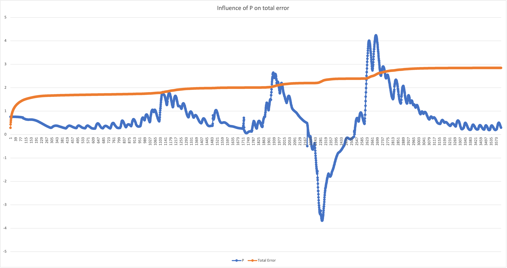
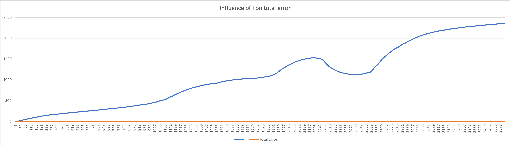
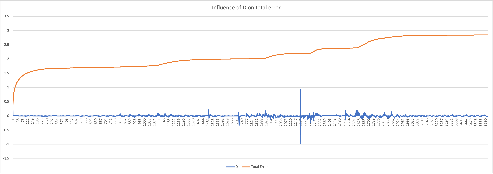
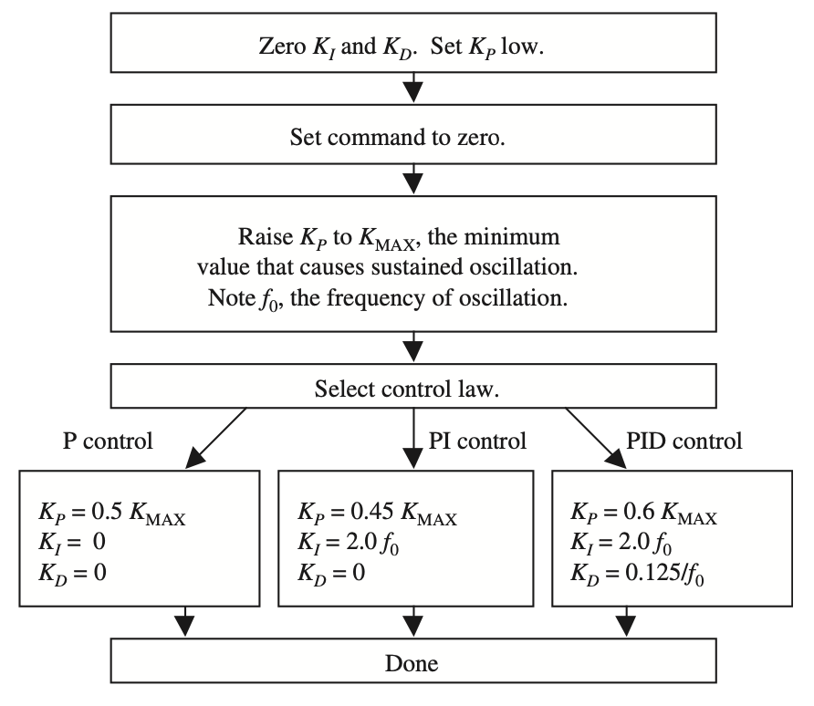

# PID Controller
I completed this project as part of [Udacity](https://www.udacity.com)'s [Self-driving Car Engineer Nanodegree](https://www.udacity.com/course/self-driving-car-engineer-nanodegree--nd013).

_Control_ in this context refers to how we use the steering, throttle, and breaks to move a car where we want it to go. Control is a trickier problem than it might first seem. When a human comes to an intersection, we use our intuition to determine how hard to steer, when to accelerate, or whether we need to step on the brakes. Teaching a computer how to do this is difficult.

# Project Goal

Control algorithms are often called _controllers_. One of the most common and fundamental of controllers is called the **PID controller**. The goal of this project is to implement a PID controller in C++, and tune the PID hyperparameters, to enable a self-driving car to manoeuvre around a track.

* The simulator provides the cross track error (CTE) and the velocity (mph) in order to compute the appropriate steering angle.
* The speed limit is 100 mph. The goal is to drive SAFELY as fast as possible. There is no specified minimum speed.

This animated GIF is a preview of my PID controller implementation in action. The remainder of this README has more details.


# Project Specification

|Category | Criteria | Specification | Status
|:--- | :--- | :--- | :---:
**Compilation** | The code compiles correctly.| Code must compile without errors with `cmake` and `make`. | Done
**Implementation** | The PID procedure follows what was taught in the lessons.| It's encouraged to be creative, particularly around hyperparameter tuning/optimization. Base algorithm follows what was taught in the lessons. | Done
**Reflection** | Describe the effect each of the P, I, D components had in your implementation. |Student describes the effect of the P, I, D component of the PID algorithm in their implementation. Is it what you expected? Visual aids are encouraged, i.e. record of a small video of the car in the simulator and describe what each component is set to. | Done
| | Describe how the final hyperparameters were chosen. | Student discusses how they chose the final hyperparameters (P, I, D coefficients). This could be have been done through manual tuning, twiddle, SGD, or something else, or a combination! | Done
**Simulation** | The vehicle must successfully drive a lap around the track. | No tire may leave the drivable portion of the track surface. The car may not pop up onto ledges or roll over any surfaces that would otherwise be considered unsafe (if humans were in the vehicle). | Done

## Implementation

Consider a car with steerable front wheels and non-steerable back wheels. We want our car to drive along a line that we call the “_reference trajectory_”. If we assume for the car has a fixed forward velocity, then we have the ability to set the steering angle of the car by steering in proportion to the **Cross Track Error (CTE)**.

A potential problem with regular cars: we buy a new car but the mechanic has inadvertently set the wheel alignment a little off. As humans, we notice this and we compensate while driving. But what about a self-driving car?

This mis-alignment is an example of systematic bias and causes a lot of error, i.e., it results in a large CTE. Even though the bias is not in the steering itself, it manifests itself as an increased error in the `y` direction.

### PID Procedure
> " A PID controller continuously calculates an error value _e(t)_ as the difference between a desired setpoint (SP) and a measured process variable (PV) and applies a correction based on _proportional_, _integral_, and _derivative_ terms (denoted `P`, `I`, and `D` respectively), hence the name." ([Wikipedia](#references))

In practical terms it automatically applies an accurate and responsive correction to a control function. An everyday example is the cruise control on a car, where ascending a hill would lower speed if only constant engine power were applied. The controller's PID algorithm restores the measured speed to the desired speed with minimal delay and overshoot by increasing the power output of the engine ([Wikipedia](#references)).

To adjust to the bias in a self-driving car, the car must steer towards the reference trajectory. To do this successfully, we need good control gains, i.e., good values of Tau-P, Tau-I, Tau-D. One way to achieve this, and the option I chose for this project, is to use [the Twiddle algorithm with the PID](#twiddle).

## Reflection

### Effect of PID Components

The PID components:

**P** is proportional to the current value of the `SP-PV` error `e(t)`. For example, if the error is large and positive, the control output will be proportionately large and positive, taking into account the gain factor `K`. Using proportional control alone will result in an error between the setpoint and the actual process value because it requires an error to generate the proportional response. If there is no error, there is no corrective response.

This is a graph of `P` and total error create from the [data of the self-driving car](logs/driving_log_pid.csv) using my PID controller. The graph confirms that the `P` value is large and positive in proportion to the growing error. 

  

**I** accounts for past values of the `SP-PV` error and integrates them over time to produce the `I` term. For example, if there is a residual `SP-PV` error after the application of proportional control, the integral term seeks to eliminate the residual error by adding a control effect due to the historic cumulative value of the error. When the error is eliminated, the integral term will cease to grow. This will result in the proportional effect diminishing as the error decreases, but this is compensated for by the growing integral effect.

This is a graph of `I` and total error create from the [data of the self-driving car](logs/driving_log_pid.csv) using my PID controller. The error is never eliminated, and so `I` does not stop growing. The growing integral effect is clearly visible in the graph.



**D** is a best estimate of the future trend of the `SP-PV` error, based on its current rate of change. It is sometimes called "anticipatory control", as it is effectively seeking to reduce the effect of the `SP-PV` error by exerting a control influence generated by the rate of error change. The more rapid the change, the greater the controlling or damping effect.

This is a graph of `D` and total error create from the [data of the self-driving car](logs/driving_log_pid.csv) using my PID controller. The graph illustrates the rapid changes in the track, resulting in a growing `D` value.




### Hyperparameter Selection

This diagram shows the Zieger-Nichols Method for tuning P, PI, and PID controllers ([Ellis, 2012](#references)):



"_The Ziegler–Nichols tuning method is a heuristic method of tuning a PID controller. It was developed by John G. Ziegler and Nathaniel B. Nichols. It is performed by setting the `I` (integral) and `D` (derivative) gains to zero. The "`P`" (proportional) gain, `K_p` is then increased (from zero) until it reaches the ultimate gain `K_u`, at which the output of the control loop has stable and consistent oscillations. `K_u` and the oscillation period `T_u` are then used to set the `P`, `I`, and `D` gains"_ ([Wikipedia](#references)). 

I arrived at the following initial values for `P`, `I`, and `D` following a process of experimentation with different values. These are used to initialize my PID controller in [main.cpp](src/main.cpp).

```c++
    PID pid_steering_controller;

    double initial_p = 0.1;
    double initial_i = 0.00;
    double initial_d = 10.0;
    pid_steering_controller.Init(initial_p, initial_i, initial_d);
```

I set the maximum speed to 50 mph. I tried different speeds, and found the car tends to collide with the side of track at around 70-75 mph using this controller. You can vary the speed by changign the value of `MAX_SPEED` in [main.cpp](src/main.cpp).

One improvement I could make to the project would be to write a second PID controller for the throttle, but for now, the implementation meets specifications without that.

```c++
    double MAX_SPEED = 0.50;  // 0.5 = 50 mph

    // Calculate the steering value; remember the steering value is in the range [-1, 1]
    steer_value = pid_steering_controller.UpdateError(cte);
    total_error = pid_steering_controller.TotalError(cte);

    ...
    
    json msgJson;
    msgJson["steering_angle"] = steer_value;
    msgJson["throttle"] = MAX_SPEED;
```

### Twiddle

A run() function returns some measure of goodness, i.e., `run() -> goodness`. This goodness might be the average crosscheck error. In my PID controller I implement Twiddle to minimise the average crosscheck error.

In this case the output of `run()` depends on the 3 `Tau` parameters.

Here’s how Twiddle works:
Build a parameter vector of our three target parameters, initialised to 0

> ```p = [0, 0, 0]```

Build a vector of potential changes that we want to probe, and initialize them for now to 1

> ```dp = [1, 1, 1]```

Then, call the `run()` function with our parameters and whatever it outputs is our best error so far.

> ```best_err = run(p)```

We want to modify p so as to make the error smaller. That’s where Twiddle comes in.

Here is a sample pseudocode implementation of the basic Twiddle algorithm in Python:

```python
while sum(dp) > 0.00001. # while sum is larger than a specified threshold value

	for i in range(3):
  		p[i] += dp[i[
		err = run(p)

  		if err < best_Err
			best_err = err
			dp[i] *= 1.1. # modify dp to a slightly larger value 
		else
			p[i] -= 2 * dp[i] # subtract dp from p, do it twice
		else # if both of the above fail
			p[i] += dp[i]
			dp[i] *= 0.9
```

For each coordinate in isolation, Twiddle moves the parameter up or down a little, by the values in `dp`. We bump up and down by some probing interval. If we find neither up nor down helps, we retain original value, and make probing interval smaller.

My C++ implementation of Twiddle is in the `Twiddle` struct in [twiddle.h](src/twiddle.h).

```c++
    double TotalError(double *p, const double cte)
    {
        this->iteration += 1;
        total_error += cte * cte / this->iteration;

        // Activate twiddle
        if(this->iteration == this->twiddle_update)
        {
            this->best_error = total_error;
            this->Run(p);
            this->stage += 1;
        }

        if(this->iteration > this->twiddle_update and
           this->iteration % this->twiddle_update == 0)
        {
            this->Run(p);
            total_error = 0;
            this->iteration = 1000;
            this->stage += 1;

            if(this->stage > 3)
            {
                this->stage = 1;
                this->param += 1;

                if(this->param > 2)
                {
                    this->param = 0;
                }
            }
        }

        return total_error;
    }
```

The `Run()` method that is called from the above method is also part of the `Twiddle` struct in [twiddle.h](src/twiddle.h)

```c++
    void Run(double *p)
    {
        this->sum_dp = 0;

        // Sum the P,I,D controller parameter changes
        for(int i = 0; i < 3; i++)
        {
            this->sum_dp += this->dp[i];
        }

        if(this->sum_dp > this->tolerance and this->stage == 1)
        {
            p[this->param] += this->dp[this->param];
            total_error = 0;
        }

        if(this->sum_dp > this->tolerance and this->stage == 2)
        {
            if(total_error < this->best_error)
            {
                this->best_error = total_error;
                this->dp[this->param] *= 1.1;
                total_error = 0;
            }
            else
            {
                p[this->param] -= 2 * dp[this->param];
                total_error = 0;
            }
        }

        if(this->sum_dp > this->tolerance and this->stage == 3)
        {
            if(total_error < this->best_error)
            {
                this->best_error = total_error;
                this->dp[this->param] *= 1.1;
                total_error = 0;
            }
            else
            {
                p[this->param] += this->dp[this->param];
                this->dp[this->param] *= 0.9;
                total_error = 0;
            }
        }
    }
```

## Simulation

The vehicle successfully drives a lap around the track.	
* With this implementation, the car can actually drive successfully for multiple laps. I always had to stop the simulator after multiple laps, as it does not crash.
* No tire leaves the drivable portion of the track surface. 
* The car does not pop up onto ledges or roll over any surfaces that would otherwise be considered unsafe.

The video below shows an example of the self-driving car using my PID. The video shows a little over a full lap. The bridge is one of the toughest parts of the track to navigate, and I wanted to show the car successfully navigating the bridge twice.

[](https://youtu.be/wLro7LwDlis "Video of car driving autonomously for (more than) a full lap")

This GIF is a shorter extract showing the car navigating the bridge area of the track:


# Building and running the project

## Code Style

This project employs [Google's C++ style guide](https://google.github.io/styleguide/cppguide.html).

## Important Dependencies

* cmake >= 3.19
    * All OSes: [click here for installation instructions](https://cmake.org/install/)
* make >= 4.1 (Linux, Mac), 3.81 (Windows)
    * Linux: make is installed by default on most Linux distros
    * Mac: [install Xcode command line tools to get make](https://developer.apple.com/xcode/features/)
    * Windows: [Click here for installation instructions](http://gnuwin32.sourceforge.net/packages/make.htm)
* gcc/g++ >= 5.4
    * Linux: gcc / g++ is installed by default on most Linux distros
    * Mac: same deal as make - [install Xcode command line tools](https://developer.apple.com/xcode/features/)
    * Windows: recommend using [MinGW](http://www.mingw.org/)
* Self-Driving Car Simulator
    * [Term 2 Simulator](https://github.com/udacity/self-driving-car-sim/releases) from Udacity, built with the Unity game engine
* uWebSockets
    * Set up and install [uWebSocketIO](https://github.com/uWebSockets/uWebSockets)
    * Note: the branch `e94b6e1` is the version of `uWebSocketIO` that works with the Udacity simulator
* JSON for Modern C++ >= version 3.0.0
    * Available from https://github.com/nlohmann/json
    * Included in this project in the header [json.hpp](src/json.hpp)
* C++ cubic spline interpolation
    * The latest version is [from GitHub](https://github.com/ttk592/spline/)
    * Included in this project in the header [spline.h](src/spline.h)

## Basic Build Instructions

1. Clone this repo.
2. Make a build directory: `mkdir build && cd build`
3. Compile: `cmake .. && make`
    * On Windows, you may need to run: `cmake .. -G "Unix Makefiles" && make`
4. Run it: `./path_planning`


# References
* Ellis George, 2012. _"Four Types of Controllers."_ Control System Design Guide - Using Your Computer to Understand and Diagnose Feedback Controllers. 4th ed. Elsevier. 1-2.
* Farag, W., 2019. _Complex trajectory tracking using PID control for autonomous driving_. International Journal of Intelligent Transportation Systems Research, pp.1-11.
* Wikipedia. [Ziegler–Nichols method](https://en.wikipedia.org/wiki/Ziegler–Nichols_method)
* Wikipedia. [PID Controller](https://en.wikipedia.org/wiki/PID_controller).
